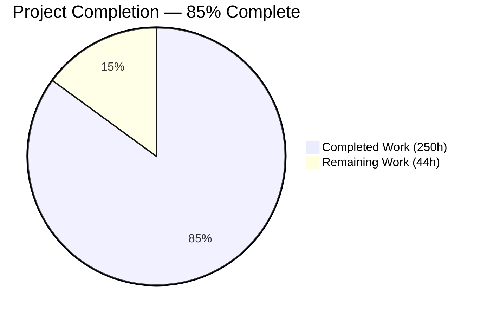
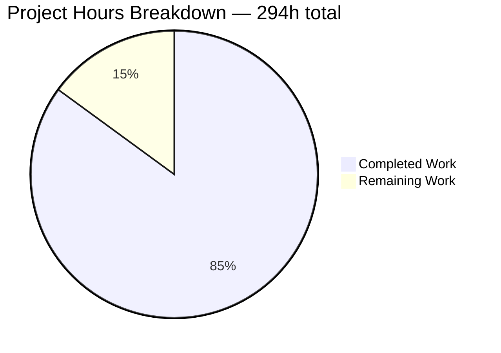
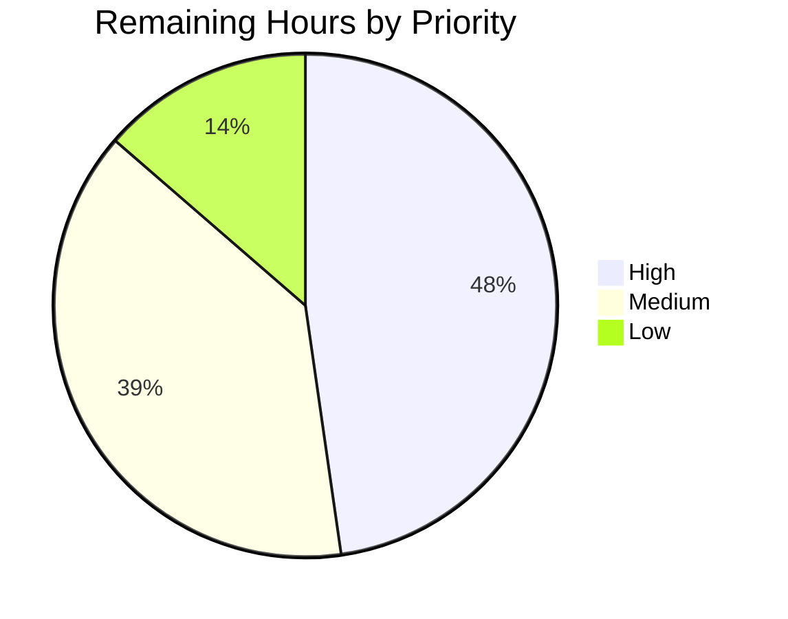
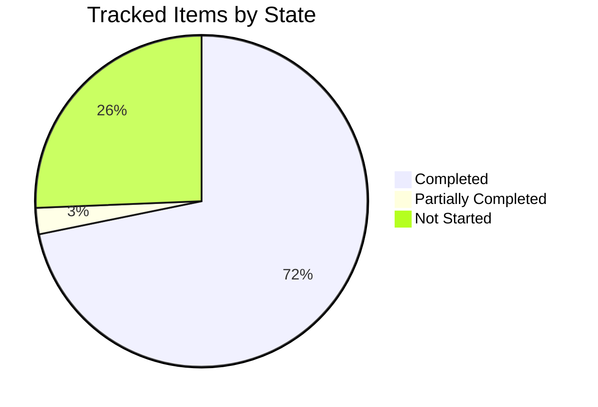

# 1. Executive Summary

## 1.1 Project Overview

Grafana playlists cycle through dashboards but could not parameterise them, so a dashboard built around `$host` could only ever show one host. Every playlist item of type `dashboard_by_uid` may now carry an optional `variables` map, which playback applies as repeated `var-<name>=<value>` URL parameters — so one parameterised dashboard rotates through Host1, Host2 and Host3, and the same dashboard may appear several times with different values. Users edit the values per row in the playlist form. The field is optional in the kind schema, both served API versions, the deprecated `/api/playlists` bridge, the generated client and storage, so older playlists load and play unchanged.

## 1.2 Completion Status



Chart colours: **Completed = Dark Blue `#5B39F3`**, **Remaining = White `#FFFFFF`**.

| Metric | Value |
| --- | --- |
| Total Hours | **294** |
| Completed Hours (AI + Manual) | **250** (250 autonomous, 0 manual) |
| Remaining Hours | **44** |
| Percent Complete | **85%** (250 ÷ 294) |
| Tracked Items | 39 — 28 complete, 1 partially complete, 10 not started |

Scope counted: 24 feature deliverables, 6 acceptance gates and 9 path-to-production activities.

## 1.3 Key Accomplishments

- ✅ Optional `spec.items[].variables` published across the kind schema, both API versions, every specification artifact and the generated client.
- ✅ Playback emits repeated, percent-encoded `var-` parameters and rotates one dashboard without remounting it.
- ✅ Per-row variables editor in the playlist form: add, rename, remove, multi-value entry, inline validation.
- ✅ Variable-less playlists unchanged on the wire, pinned to exact response bytes.
- ✅ Admission refuses out-of-bounds writes — 32 variables, 64 values, 128- and 1024-code-point limits — with field-accurate `422`s.
- ✅ Server-side apply works for playlists that have items, and field ownership survives a version change.
- ✅ The deprecated list endpoint returns every playlist and flags truncation instead of dropping rows.
- ✅ 428 frontend tests, 337 Go test nodes and every lint, format, typecheck and generation gate pass.

## 1.4 Critical Unresolved Issues

Eleven of the 39 tracked items are open. All 24 feature deliverables are complete; each open item is a release decision, a platform follow-up or a pre-existing weakness.

| Issue | Impact | Owner | ETA |
| --- | --- | --- | --- |
| Review gate not passed — nothing published; the change is one branch of 82 files that the plan wants split into a backend pull request followed by a frontend one | Blocks release | Reviewer / release owner | 6h |
| Four scope decisions await confirmation: the admission validator, the 4 MiB legacy body cap, the list/listitem row structure, and the files changed outside the plan's list (§5.2) | Blocks sign-off | Reviewer | 4h |
| Anonymous cross-organization playlist reads are still possible when anonymous access is enabled and `playlistsRBAC` is off, and playlist collections are unbounded server-side beyond the per-item maxima | Pre-existing security exposure | Security owner | 8h |
| Two generators cannot run here: `CODEGEN_VERIFY=1 make gen-apps` needs network access and `make openapi3-gen` was not re-verified; `yarn generate-apis` and `make i18n-extract` are confirmed idempotent | Code generation gate unverified | Backend engineer | 3h |
| `public/api-enterprise-spec.json` is hand-mirrored because the enterprise generator is skipped in an open-source checkout | Possible specification drift | Backend engineer | 2h |
| Playback toolbar gaps: keyboard focus falls to the document body across a cross-dashboard advance, no "item N of M" indicator exists, and full kiosk mode renders no playlist controls even when navigation buttons are requested | Accessibility and usability during playback | Dashboards team | 6h |
| Two upstream `grafana-app-sdk` v0.59.0 defects: a status-conversion error logged on a v0alpha1 server-side apply, and `managedFields` dropped on a v0alpha1→v1 update sequence | Log noise and lost field metadata; writes still succeed | Platform / upstream | 6h |
| Platform behaviour changes ride on this branch — unified-storage error envelopes for every resource kind, an `/api/health` 503 for a denying database, equalized failed-password timing — and need release notes and a backport decision | Operational surprise for operators | Release owner | 3h |
| Tail latency under 10 concurrent clients exceeded the 3× guardrail on playlist reads on shared hardware, with unrelated endpoints worse | Unverified performance criterion | Performance owner | 2h |
| No browser-level regression specification covers the editor or playback; both are protected by unit and integration tests only | Regression risk after future refactors | Frontend engineer | 3h |
| Two prose defects and one inconsistent mode count remain on the playlist user guide page | Documentation polish | Docs owner | 1h |

## 1.5 Access Issues

| System/Resource | Type of Access | Issue Description | Resolution Status | Owner |
| --- | --- | --- | --- | --- |
| Go module proxy / `go get` | Outbound network | `make gen-apps app=playlist` fetches the pinned App SDK before generating, so the `CODEGEN_VERIFY` idempotency gate cannot run in an offline checkout | Open — run in continuous integration or a network-enabled checkout | Backend engineer |
| Grafana Enterprise source (`pkg/extensions/ext.go`) | Repository access | Absent in an open-source checkout, so `swagger-enterprise-gen` is skipped and `public/api-enterprise-spec.json` must be mirrored by hand | Open — verify in an enterprise-linked build | Backend engineer |
| Git remote | Push permission | The branch is unpublished by design: the plan requires explicit human approval before any push | Open — awaiting approval | Reviewer |

No credential, key or third-party service access is needed: the feature adds no runtime dependency and reads no secret.

## 1.6 Recommended Next Steps

1. **[High]** Split the branch into the backend and then the frontend pull request, and settle the four scope decisions in §5.2 during that review.
2. **[High]** Land the cross-organization read hardening as its own security change, and decide whether playlist writes need an aggregate budget.
3. **[High]** Re-run the two outstanding generators in a network-enabled checkout, and verify the enterprise specification in an enterprise-linked build.
4. **[Medium]** Publish release notes for the platform behaviour changes carried here, and decide backports.
5. **[Medium]** Schedule the playback toolbar follow-ups and the upstream App SDK fixes with a version bump.

# 2. Project Hours Breakdown

## 2.1 Completed Work Detail

| Component | Hours | Description |
| --- | --- | --- |
| Item schema and generated API types | 18 | Optional `variables?: [string]: [string, ...string]` on `#PlaylistItem` (`apps/playlist/kinds/playlist.cue`), regenerated v1 and v0alpha1 spec types and both embedded manifest schemas, plus removal of the `$ref`-only item alias so `spec.items[i]` resolves to a concrete model |
| Legacy REST bridge types and conversions | 7 | `Variables map[string][]string` on the request and response DTOs with `xorm:"-" db:"-"`, and `LegacyUpdateCommandToUnstructured` emitting JSON-compatible unstructured entries only when the map is non-empty |
| Legacy bridge unit tests | 10 | `pkg/registry/apps/playlist/conversions_test.go` and `apps/playlist/pkg/app/conversion_test.go` — round trips, multi-key maps, explicit empty maps, duplicate UIDs and the exact key set of a variable-less item |
| Playlist API integration suite | 12 | `pkg/tests/apis/playlist/playlist_test.go` — variables round trip through the legacy bridge and both served versions, exact-byte compatibility for variable-less playlists, cross-version field ownership, the 11-case bounds group, and the Kubernetes CRUD flow with its legacy cross-check |
| Contract artifact regeneration | 8 | Both OpenAPI snapshots, `public/api-merged.json`, `public/openapi3.json`, the mirrored enterprise specification, both processed `@grafana/openapi` specs and the RTK Query client |
| Playback runtime variable application | 8 | `PlaylistSrv` per-entry `{ url, variables }` model, one serializer call producing repeated percent-encoded `var-` parameters, tag items ignored, empty names and values skipped, kiosk parameters preserved |
| Playback runtime test suite | 8 | `PlaylistSrv.test.ts` — multi-value, encoding of hostile names and values, kiosk coexistence, same-path entries, variable-less items, tag items and the loop reload |
| Editor state hook and form submit path | 11 | `usePlaylistItems.updateItemVariables` as an immutable functional update, a race-free dashboard-enrichment merge, and `PlaylistForm` threading plus omission of empty maps on submit |
| Item rows, table and disclosure | 11 | `PlaylistTableRows` disclosure with `aria-expanded`/`aria-controls` and a variable-count summary, `PlaylistTable` expansion state with collapse on reorder or deletion and stable per-item row identity |
| Variables editor component | 16 | `PlaylistItemVariables.tsx` — draft model, exactly-once commit, comma splitting and trimming, duplicate and empty rejection, rename semantics, removal, name-ordered rows, pending-draft hint and Enter handling that never submits the form |
| Editor and table Jest suites | 24 | `PlaylistItemVariables.test.tsx`, `PlaylistTable.test.tsx` and the extended `PlaylistForm.test.tsx` — editor behaviour, collapse invariants, duplicate dashboards, save/load fidelity, enrichment race and immutability |
| Localization catalogue and documentation | 7 | 75 catalogue lines under the `playlist-edit.form.*` and `playlist.*` namespaces, the HTTP API reference field description with the enforced maxima, and the user guide create/edit steps with the URL-visibility caution |
| Server-side admission validation | 12 | `ValidatePlaylistObject` and the installer admission wrapper enforcing 32 variables, 64 values, 128-code-point names, 1024-code-point values and a non-blank name rule, with field-accurate 422 causes and bounded messages, plus `app_test.go` |
| Shared variable budget and playback bounds | 5 | `variableLimits.ts` as the single source of the maxima, the blank-name predicate and the 8192-character encoded-URL budget, consumed by both the editor and playback |
| Editor robustness, accessibility and lifecycle | 30 | Commit-on-blur and submit-time settle with a refusal path, focus return on unmount, list/listitem ARIA with uniquely named regions, bidi-isolated labels, narrow-viewport layout, the dashboard picker's accessible name and no-remount selection, and the list, card, new/edit page and start-modal states with their suites |
| Legacy list completeness and error envelope | 17 | Continuation-token walk with a bounded page count and a truncation warning header, list-page truncation notice, uid pre-validation, one error envelope, the 4 MiB body cap and `pkg/api/playlist_test.go` |
| Unified storage error reporting and SQLite utilities | 20 | Typed statuses for invalid names, cluster-scoped lists and bad continuation tokens, sanitised storage messages, a retry signal under contention, the shared SQLite helper and their test suites |
| Shared authentication timing and health probe | 7 | Equalised failed-password timing for logins that do not resolve, and a database probe that reports `503` when the database is present but denying, both with tests |
| Dashboard search de-duplication | 2 | `loadDashboards` answers items that share a type and value from one search, so a playlist listing the same dashboard many times issues one request instead of one per row |
| Verification gates executed | 17 | Build, unit, integration, Jest, gofmt, `golangci-lint`, ESLint, Prettier, monorepo typecheck, client generation and localization idempotency runs, plus the live API and browser acceptance passes |
| **Total** | **250** | |

## 2.2 Remaining Work Detail

| Category | Hours | Priority |
| --- | --- | --- |
| Review gate: split into the backend-first and frontend-second pull requests, obtain approval, publish | 6 | High |
| Adjudicate the four scope decisions beyond the plan's file list (§5.2) | 4 | High |
| Anonymous cross-organization read hardening and the server-side collection-bounds decision | 8 | High |
| Code generation verification in a network-enabled checkout (`CODEGEN_VERIFY=1 make gen-apps`, swagger regeneration) | 3 | High |
| Enterprise specification verification in an enterprise-linked checkout | 2 | Medium |
| Playback toolbar follow-ups: focus restoration, position indicator, kiosk controls | 6 | Medium |
| Upstream App SDK status and `managedFields` fixes, then the pinned-version bump | 6 | Medium |
| Release notes and backport decision for the platform behaviour changes | 3 | Medium |
| Concurrency guardrail re-measurement on dedicated CPU | 2 | Low |
| Browser-level regression coverage for the editor and playback flows | 3 | Low |
| Playlist user guide prose cleanup | 1 | Low |
| **Total** | **44** | High 21 / Medium 17 / Low 6 |

## 2.3 Basis Of Estimate

Hours were derived per deliverable from the delivered volume and its category: 82 files changed, +18,703 and −460 lines across 18 commits, of which roughly 8,900 lines are test code. Simple typed-field and regeneration work was costed at the low end (2–8 hours), the editor component and its suite at feature rates (16 and 24 hours), and integration and admission work in between. Completed hours count only work that exists in the branch and passes its gates; anything unfinished sits in §2.2 at its full remaining cost.

Confidence: **High** for the feature deliverables, the acceptance gates and the review-and-publish work, all of which are bounded and evidenced in the repository. **Medium** for the security hardening and the upstream App SDK fixes, which depend on decisions and on a third-party release. **Medium** for the playback toolbar follow-ups, which sit on a surface this project was told not to modify and need a product decision before implementation.

Completion arithmetic: 250 completed ÷ (250 completed + 44 remaining) = 250 ÷ 294 = **85%**.

# 3. Test Results

Every row below was executed on this branch and its result observed directly. Commands are in §9 and §10A.

| Area / Category | Framework | Tests | Passed | Failed | Coverage | What This Proves |
| --- | --- | --- | --- | --- | --- | --- |
| Playlist bridge and app module — unit | Go `testing` + testify | 209 | 209 | 0 | 75.8% (`pkg/registry/apps/playlist`), 73.9% (`apps/playlist/pkg/app`) | Variables survive the legacy conversions and the cross-version converter, a variable-less item carries exactly `type` and `value`, and admission refuses every out-of-bounds shape |
| Legacy `/api/playlists` handlers — unit | Go `testing` + testify | 53 | 53 | 0 | 49.6% (`pkg/api`) | The deprecated endpoints validate uids, cap oversized bodies, return one error envelope and walk continuation tokens to a complete list |
| Playlist API — live integration | Go `testing` against an in-process server | 23 nodes | 23 | 0 | End-to-end | Variables round-trip through the legacy bridge, v1 and v0alpha1; variable-less responses match exact expected bytes; field ownership survives a version change; 11 bounds cases refuse or accept exactly as published; Kubernetes CRUD passes with the legacy cross-check |
| Served OpenAPI contract — live integration | Go `testing` against an in-process server | 29 nodes | 29 | 0 | All served groups | The committed `playlist.grafana.app` v1 and v0alpha1 snapshots match what the API server serves, so the published contract is exactly the one in the repository |
| Legacy→unified storage migration | Go `testing` against an in-process server | 26 nodes | 23 | 0 (3 pre-existing skips) | Playlist fixture path | Rows in the obsolete playlist tables still migrate into unified storage with the new optional field absent |
| Playlist frontend feature | Jest + React Testing Library | 374 | 374 | 0 | 12 suites, whole feature folder | Editor add/rename/remove/validate, collapse on reorder and deletion, duplicate dashboards with distinct values, save-and-reload fidelity, enrichment race, and `var-` URL assembly including hostile names and values |
| Generated client packages | Jest | 54 | 54 | 0 | 7 suites | The processed specifications and RTK Query client generation behave as their scripts intend after the schema change |
| Static and generation gates | gofmt, golangci-lint, ESLint, Prettier, tsc, generators | 8 gates | 8 | 0 | — | Formatting and lint clean on the changed Go and TypeScript, typecheck green across 15 projects, and `yarn generate-apis` plus `make i18n-extract` leave a clean tracked tree |

**Totals observed: 765 passing test nodes, 0 failing, 3 pre-existing skips** (two migration steps and one chunked-migration case skipped by design in this configuration, unchanged by this project).

### Not Covered

- **Playback controls on the dashboard toolbar.** Keyboard focus behaviour, the absent position indicator and kiosk-mode control rendering have no test here; they live on a surface this work was scoped not to modify. Exercise them by hand before release, or with the follow-up in §2.2.
- **Browser-level regression gate.** No end-to-end specification was added, so nothing in continuous integration drives the editor or playback in a browser. The two flows worth pinning are "create a playlist with per-item variables and save" and "rotate one dashboard through two variable sets".
- **The mirrored enterprise specification.** `public/api-enterprise-spec.json` is maintained by hand in an open-source checkout and no test compares it to generator output; verify it in an enterprise-linked build.
- **Cross-version `managedFields` and status behaviour.** The upstream App SDK behaviour was observed by hand; no automated test asserts the v0alpha1→v1 update sequence.
- **Concurrency and tail latency.** No suite gates the 10-client read guardrail; it was measured by hand on shared hardware and needs a dedicated-CPU re-run.
- **Variables on `dashboard_by_tag` items.** Deliberately unsupported; the runtime guard is unit-tested, but no negative test covers a tag item that carries variables written directly through the API.

# 4. Runtime Validation & UI Verification

A server was built from this branch (`make build-go`, 527 MB binary) with a production frontend bundle (`yarn build`, 1,047 files), started on embedded SQLite, and driven through the API and a real browser.

- ✅ **Start-up and health** — the server reported `{"database":"ok","version":"13.3.0-local"}` and logged no error-level line for the whole session, including on every playlist write.
- ✅ **Authentication** — form login and HTTP basic auth both succeed; failed attempts on logins that do not resolve now cost the same as attempts on logins that do, with identical `401` bodies.
- ✅ **Legacy `/api/playlists`** — create, read, update, delete, `/items` and list all behave; a playlist created with two items for the same dashboard UID and different variable sets echoes both maps.
- ✅ **Backward compatibility** — a variable-less playlist's legacy body is compact JSON with no `variables` key and a single trailing newline, exactly as before the change.
- ✅ **Resource APIs** — the same object read through `playlist.grafana.app/v1` and `/v0alpha1` carries the identical variables on both UID items and no `variables` key on the tag item; server-side apply succeeds for playlists that have items.
- ✅ **Admission refusals** — a 5,000-variable item returns `422` with a 156-byte body naming the maximum, and a name made only of a zero-width space returns `422` whose `details.causes[0].field` is `spec.items[0].variables[…]`.
- ✅ **Editor in a browser** — the edit form shows two rows for one dashboard with summaries "1 variable · host=Host1" and "1 variable · host=Host2"; the disclosure opens a uniquely named region pre-populated from storage; adding `zone` = `eu, us` commits and updates the summary; an empty name shows "Variable name is required" and adds nothing; Save issues exactly one `PUT` returning `200` whose body carries `"variables":{"host":["Host1"],"zone":["eu","us"]}`; a reload shows both values.
- ✅ **Save refusal** — attempting to save while an invalid draft is open is refused in place with a message telling the user to complete or remove it, and issues no request.
- ✅ **Playback rotation** — `/playlists/play/<uid>` loads `…/d/guidehost1/guide-host-dashboard?var-host=Host1` with the variable control on Host1, then advances to `?var-host=Host2` on the same path; document identity and navigation timing are unchanged, so the advance re-syncs the scene client-side with no dashboard refetch, and the panel content follows. Stopping playback holds the last item beyond one interval.
- ⚠ **Playback toolbar** — the previous/stop/next controls work, but keyboard focus falls to the document body across a cross-dashboard advance, no "item N of M" indicator is rendered, and full kiosk mode shows no controls at all; the Start dialog and user guide now state the kiosk behaviour and the Escape recovery.

Across both browser passes: 172 requests, every one `200`, and zero console errors. Nothing in the delivered scope is unexercised at runtime except the hand-mirrored enterprise specification, which has no runtime behaviour, and the upstream cross-version `managedFields` sequence, which was reproduced by hand rather than gated.

# 5. Compliance & Quality Review

## 5.1 Compliance Matrix

Status is where each deliverable stands now, on this branch.

| Deliverable | Benchmark | Status | Evidence |
| --- | --- | --- | --- |
| Optional per-item `variables` in the kind schema | Optional everywhere; regenerated, never hand-edited | ✅ Pass | `apps/playlist/kinds/playlist.cue`; regenerated v1/v0alpha1 spec types and manifest schemas |
| Both served API versions publish the field | Contract parity across versions | ✅ Pass | Both `pkg/tests/apis/openapi_snapshots/playlist.grafana.app-*.json`; snapshot equality test green |
| Legacy `/api/playlists` carries the field | No silent field loss on create or update | ✅ Pass | `pkg/registry/apps/playlist/{legacy.go,conversions.go}`; live create/read/update |
| Backward compatibility for variable-less playlists | Byte-for-byte identical responses | ✅ Pass | Exact-byte assertions in `pkg/tests/apis/playlist/playlist_test.go`; live body ends `…}]}\n` with no `variables` |
| Frontend client and types | Generated, not hand-written; clean tree afterwards | ✅ Pass | `packages/grafana-api-clients/.../playlist/v1/endpoints.gen.ts`; `yarn generate-apis` leaves no diff |
| Runtime applies `var-<name>=<value>` | One serializer call; keys and values encoded; repeated for multi-value | ✅ Pass | `public/app/features/playlist/PlaylistSrv.ts`; `PlaylistSrv.test.ts`; observed URL rotation |
| Repeatable dashboards with different value sets | Same UID may appear more than once | ✅ Pass | Two rows for one dashboard in the editor and in storage; no de-duplication added |
| Editor add / edit / remove per row | Comma-separated multi-value entry; empty names and values rejected | ✅ Pass | `PlaylistItemVariables.tsx` with 374 passing feature tests; observed inline rejection |
| Security posture of variable input | Single encoding point; no new SQL or execution path; documented URL exposure | ✅ Pass | Encoding pinned by tests; caution admonition in the user guide |
| Localization and documentation | Extracted strings; repository documentation conventions | ✅ Pass | 75 catalogue lines; both documentation pages; `make i18n-extract` idempotent |
| Acceptance gates: build, lint, format, typecheck, tests | All green | ✅ Pass | gofmt silent, `golangci-lint` "0 issues.", ESLint and Prettier exit 0, typecheck across 15 projects, suites in §3 |
| Acceptance gates: full codegen idempotency and review gate | Generators leave a clean tree; approval before publishing | ⚠ Partial | Client and localization generation verified here; the App SDK and swagger generators need network or an enterprise checkout, and the branch is unpublished |

## 5.2 AAP & Rule Divergences and Gaps

No user-specified rules exist for this project, so no rule can have been diverged from; the conventions applied instead were the repository's own. The eight rows below are the departures from the plan.

| What the AAP/Rule Required | What Was Delivered Instead | Why It Diverged | Impact | Remediation |
| --- | --- | --- | --- | --- |
| §0.6.2: the app's admission validator and mutator "stay no-ops" | A validator enforcing four maxima and a non-blank-name rule; the mutator is untouched | Direct API writes could otherwise store items that playback cannot render, and the numbers are the editor's own | Writes past the maxima now return `422` instead of being stored; no payload the editor accepts is refused | Confirm as product behaviour, or revert two call sites |
| §0.6.2: `pkg/api/playlist.go` is "pass-through only, no edits" | Uid pre-validation, one error envelope, a 4 MiB body cap and a continuation-token list walk | The deprecated endpoint answers `5xx` to a client-side uid error and returns only the first storage page | Client errors now return `400`; oversized bodies are refused; the list is complete or explicitly flagged | Accept, or narrow to the list behaviour alone |
| §0.6.2: eight frontend files are pass-through, and §0.2.3 lists the new files | Those files were edited and two modules were added, one of them `variableLimits.ts` | The shared variable budget and the page-level behaviour it supports have no home inside the plan's file list | Broader review surface; behaviour for variable-less playlists unchanged | Accept the wider file list in review |
| §0.5.2: rows keep `role="row"` with cells | Rows are `role="listitem"` inside a `role="list"` | A `role="region"` panel — which the same plan requires — cannot legally sit inside a table row | Accessibility improved; any query for playlist rows must use `listitem` | Note the structure in review |
| §0.5.2: the generated item struct keeps its `PlaylistItem` alias | The alias is gone; `Items` is `[]PlaylistPlaylistItem`, and three migrator type references follow | A `$ref`-only model cannot be typed, so server-side apply refuses any playlist that has items | Apply works and `managedFields` are tracked; one redundant published model name disappears | None |
| §0.1.2: change only what the feature needs | Shared platform surfaces changed: unified-storage error envelopes, the health probe, password timing, the dashboard picker | The behaviour lives only there; no playlist file can reach it | Error envelopes change for every resource kind; operators see a new health outcome | Release-note, or split out of the feature pull requests |
| Security hardening prepared earlier for playlist reads and collections | Not present on this branch | It reached beyond every file the plan allows and was never validated as a scoped change | Anonymous cross-organization reads remain possible in one configuration; collections are unbounded server-side | Land as its own security change |
| Assorted plan wording and accepted limitations (roll-up) | Delivered slightly differently in seven small ways | Each is a correctness, convention or tooling constraint | None negative; all documented | Read this row during review |

**Admission validation.** The plan kept the app's validator a no-op and placed all rejection in the editor. `apps/playlist/pkg/app/app.go` now exposes `ValidatePlaylistObject`, wired through the installer's admission plugin in `pkg/registry/apps/playlist/register.go`, refusing more than 32 variables per item, more than 64 values per variable, names beyond 128 code points, values beyond 1024, and names made only of whitespace or invisible characters. The numbers are the editor's, so nothing the UI accepts is refused, and variable-less payloads are unchanged. The same maxima are now published in the item schema and the HTTP API reference. Confirm this is wanted; reverting means dropping one call and one override.

**Legacy endpoint edits.** The plan lists `pkg/api/playlist.go` as pass-through. It now pre-validates the uid, renders one `{message, traceID}` envelope, caps request bodies at 4 MiB, and follows continuation tokens over a bounded number of pages, adding a `299` warning header when even that walk cannot finish. Without the walk the endpoint returns whatever the first storage page holds, so playlists drop out of the deprecated list once an installation grows. Response shapes for existing successful calls are unchanged, and no swagger-visible declaration moved, so the committed legacy specifications needed no regeneration. Accept it, or keep only the list behaviour.

**Wider frontend file set.** Eight files the plan marks pass-through were modified — the playlist API client, `utils.ts`, the list, new, edit and start pages, the start modal and the card — and `public/app/features/playlist/variableLimits.ts` was added, plus two test-only files. The budget module exists because both `PlaylistSrv` and the editor must share one set of maxima without the service importing React. The other edits carry focus return after the delete dialog, error-recovery states, a kiosk note, and one dashboard search per distinct item rather than one per row. None changes the feature's contract; all of them widen what a reviewer reads, which is the whole cost.

**Row ARIA structure.** The plan describes each item row keeping `role="row"` with cells, so that row counts stay stable. The delivered rows are `role="listitem"` inside a `role="list"`, with each expanded editor a uniquely named `role="region"` sibling. The plan's own requirement for that region is incompatible with a table row, which may own neither a region nor arbitrary content: an accessibility audit of that combination does not pass. The delivered structure is visually identical and audits clean. The consequence is mechanical — any future code or test that looks for playlist rows must query `listitem`, and the existing suites query it today.

**Published item model.** The plan pinned the generated item struct as `PlaylistPlaylistItem` with a `PlaylistItem` alias, and `spec.items` referencing the alias. That shape publishes a `$ref`-only OpenAPI model with no type of its own, which structured-merge-diff cannot resolve: server-side apply returns `500` for any playlist that has items and field ownership cannot be tracked — behaviour that predates this project. The CUE kind now references the item definition directly, which is the only lever the "regenerate, never hand-edit" rule leaves. Three type references in the legacy-to-unified migrator follow the rename; its queries and behaviour are untouched.

**Shared platform surfaces.** Changes outside the playlist feature ride on this branch: unified storage now returns typed statuses for invalid names, cluster-scoped lists and bad continuation tokens with sanitised messages and a retry signal; `/api/health` reports `503` when the database is present but denying; failed-password timing no longer distinguishes logins that do not resolve; and the shared dashboard picker gained an accessible name and a no-remount selection. Each behaviour lives only on those surfaces, out of reach of any playlist file. The error-envelope change is visible to clients of every resource kind, so it needs a release note and, ideally, its own pull request rather than arriving inside a playlist feature.

**Security hardening left open.** Two pre-existing weaknesses are not addressed here: playlist reads can cross organizations for an anonymous identity when anonymous access is enabled and the `playlistsRBAC` flag is off, and playlist writes are unbounded in item count and total object size even though each item's variables are bounded. Work on the first touched the shared aggregated-apiserver authorization chain — outside every file the plan permits — and was taken back off the branch rather than shipped unreviewed inside a feature change; `pkg/services/apiserver/**` is absent from the diff. Neither weakness is introduced by this feature. Land the read-path change as its own security review with its own backport decision, and decide separately whether writes need an aggregate budget.

**Roll-up of smaller departures.** Seven wording-or-tooling departures, none negative: unstructured items are `[]any` of `map[string]any` rather than the plan's literal `[]map[string]any`, which panics inside apimachinery's deep copy; the legacy specifications state the maxima in prose because the generator cannot annotate an inner array; `public/api-enterprise-spec.json` is hand-mirrored, as the plan itself anticipates for an open-source checkout; no SQL migration was added, the plan's own resolution of the prompt-versus-repository conflict; the editor also commits a pending row on blur and at submit time, and exports two hooks for that handshake; the API reference field description is seven short sentences rather than one; and a single value containing a comma still cannot be typed, the limitation the plan chose to document rather than change.

# 6. Risk Assessment

Forward-looking risks only — what could still go wrong in production.

| Risk | Category | Severity | Probability | Mitigation | Status |
| --- | --- | --- | --- | --- | --- |
| Anonymous identities can read playlists across organizations when anonymous access is enabled and `playlistsRBAC` is off; playlist writes are unbounded in item count and total object size | Security | High | Medium | Land the read-path authorization fix as its own security change; decide whether an aggregate per-object budget is wanted, with a matching editor bound | Open — §2.2, 8h |
| Platform behaviour changes ride with this branch: unified-storage error envelopes for every resource kind, a new `/api/health` failure outcome, equalized authentication timing | Operational | Medium | Medium | Release-note them and decide backports, or split them into their own pull request | Open — §2.2, 3h |
| A variables-capable UI deployed against an older backend cannot persist the field and may be rejected | Integration | Medium | Medium | Publish the backend pull request first, as the plan requires; a new backend serves old clients and old stored objects unchanged | Mitigated by plan; ordering must hold at release |
| Upstream App SDK v0.59.0 logs a status-conversion error on a v0alpha1 server-side apply and drops `managedFields` on a v0alpha1→v1 update | Technical | Low | Medium | Fix upstream, then bump the pinned version and re-run the playlist integration suite; writes return `200` and data round-trips today | Open — §2.2, 6h |
| Variable values travel in dashboard URLs, so they reach browser history, proxy and server logs, and any shared link | Security | Medium | High by design | The user guide carries a caution against secrets; a single serializer encodes keys and values so no value can inject another parameter | Accepted with documentation |
| Playback loses keyboard focus across a cross-dashboard advance, shows no position indicator, and renders no controls in full kiosk mode | Operational | Medium | High for keyboard users | Dialog and guide state the kiosk behaviour and the Escape recovery; the fixes need the dashboard toolbar surface | Open — §2.2, 6h |
| Tail latency under 10 concurrent readers exceeded the 3× guardrail on shared hardware, with unrelated endpoints worse | Technical | Low | Medium | Re-measure on dedicated vCPU before treating 3× as a criterion; throughput scaled 4.6–6.0× with zero errors | Open — §2.2, 2h |
| No browser-level regression gate covers the editor or playback, and the enterprise specification is maintained by hand | Technical | Low | Medium | Add an end-to-end specification for create-with-variables and two-host rotation; verify the enterprise specification in an enterprise-linked build | Open — §2.2, 5h combined |

# 7. Visual Project Status

**Hours: completed versus remaining** — Completed = Dark Blue `#5B39F3`, Remaining = White `#FFFFFF`.



**Remaining work by priority** (44h total):



**Tracked items by state** (39 items):



| Dimension | Completed | Remaining |
| --- | --- | --- |
| Hours | 250 | 44 |
| Feature deliverables (24) | 24 | 0 |
| Acceptance gates (6) | 4 | 1 partial, 1 not started |
| Path-to-production activities (9) | 0 | 9 |
| Remaining hours by priority | — | High 21 · Medium 17 · Low 6 |

# 8. Summary & Recommendations

The feature asked for is delivered and works. A playlist item of type `dashboard_by_uid` may now carry a map of template-variable values; playback turns each map into repeated, percent-encoded `var-<name>=<value>` parameters and pushes them at the dashboard, which re-reads them through its existing URL synchronisation. The same dashboard can appear several times with different values, so one parameterised dashboard rotates through Host1, Host2 and Host3 — the request behind the long-standing issue this project closes. The playlist form gained a per-row editor for those values, with comma-separated multi-value entry, rename, removal and inline validation. The field is optional in the CUE kind, both served API versions, the deprecated REST bridge, the generated client and storage, and a variable-less playlist serialises byte-for-byte as it did before. At **85% complete** (250 of 294 scoped hours), all 24 feature deliverables are done.

Verification went well beyond compilation. 765 test nodes pass with none failing: 209 unit cases over the bridge and the app module, 53 over the deprecated handlers, 23 live integration nodes that drive the legacy API, both resource versions and unified storage, 29 nodes proving the committed OpenAPI snapshots are exactly what the server serves, and 374 browser-level frontend tests plus 54 for the generated client packages. Lint, formatting, monorepo typecheck across 15 projects, client generation and localization extraction are all clean and idempotent. A server and production bundle built from this branch were then driven directly: variables round-trip through every write path, out-of-bounds writes are refused with field-accurate `422`s, the editor saves and reloads its values with exactly one request, and playback was watched rotating one dashboard from `?var-host=Host1` to `?var-host=Host2` client-side, with no dashboard refetch and no console errors.

The remaining 44 hours are release work, not feature work. Twenty-one hours are High priority: splitting this 82-file branch into the planned backend-then-frontend pull requests and publishing it, confirming the four scope decisions in §5.2, running the two code generators that need network access or an enterprise checkout, and landing the pre-existing playlist read-authorization hardening as its own security change. The remaining twenty-three hours cover the enterprise specification check, the playback toolbar accessibility follow-ups, two upstream App SDK defects, release notes for the platform changes carried here, a concurrency re-measurement and a browser-level regression specification.

Two things deserve a reviewer's deliberate attention. First, this branch is wider than the plan: server-side admission validation, a complete deprecated list endpoint, unified-storage error envelopes affecting every resource kind, a stricter health probe and equalized authentication timing all arrived alongside the feature because the behaviour they govern sits outside any playlist file. Each is defensible on its own and each is documented in §5.2, but they change behaviour that playlist reviewers do not own, and the error-envelope change in particular belongs in a release note. Second, two pre-existing weaknesses are knowingly left open — anonymous cross-organization playlist reads in one configuration, and unbounded playlist collections server-side — because addressing them properly reaches outside this feature. Neither is introduced here, and both have a named owner and estimate.

Production readiness: **ready to review and ship the feature, with the ordering and decisions above respected.** The contract is additive and backward-compatible, the risky input paths are bounded on both the client and the server, and the exposure that matters — variable values travelling in URLs and therefore in logs and shared links — is by design and documented as such in the user guide. The path to production is a review, a two-part publish, one security change and a release note; nothing in the feature itself is waiting on further engineering.

# 9. Development Guide

Every command below was run in this checkout. Run them from the repository root unless stated otherwise.

### System prerequisites

| Tool | Version | Why |
| --- | --- | --- |
| Go | 1.26.6 | Matches the `go` directive in `go.mod`; `go version` must print `go1.26.6` |
| Node.js | v24.11.0 | Pinned by `.nvmrc`, inside the `engines` range `>= 22 <25` |
| Yarn | 4.17.1 | `packageManager` in `package.json`; run it with the working directory inside the checkout |
| Git | 2.x with Git LFS | Repository convention |
| grafana-app-sdk | v0.59.0 | Pinned by `apps/sdk.mk`; installed by `make gen-apps` |

A C compiler is not needed — the SQLite driver is pure Go and everything here runs with `CGO_ENABLED=0`. No database, broker, credential or environment variable is required for the playlist scope. Roughly 8 GB of disk per checkout is needed for `node_modules`, the server binary and the frontend bundle.

### Environment setup and dependencies

```bash
cd <repository root>
YARN_ENABLE_PROGRESS_BARS=false CI=true yarn install --immutable

# MANDATORY, and again after every yarn install:
find public/app/plugins -maxdepth 6 -type l -path '*/node_modules/.bin/*' -delete
```

The prune is not optional. `yarn install` creates two CLI shim symlinks under `public/app/plugins/datasource/azuremonitor`; the integration harness symlinks the plugin tree into a temporary directory and the plugin loader rejects any symlink resolving outside it, so with the shims present every `TestIntegration*` under `pkg/tests/**` and `pkg/storage/unified/migrations` aborts within about half a second with `walk: file … not inside of plugin directory`. Nothing in the build or test path uses those shims.

### Build

```bash
# Playlist scope only — about 1 second warm
CGO_ENABLED=0 go build ./apps/playlist/... ./pkg/registry/apps/playlist/... ./pkg/api/...

# Whole server -> ./bin/grafana (about 2.5 minutes, 527 MB)
make build-go

# Frontend production bundle -> public/build (about 3.5 minutes, ~1,047 files)
CI=true yarn build

# Types across the monorepo (15 projects)
CI=true yarn typecheck
```

### Run

```bash
mkdir -p data/log data/plugins
GF_PATHS_DATA=$PWD/data GF_PATHS_LOGS=$PWD/data/log GF_PATHS_PLUGINS=$PWD/data/plugins \
GF_SERVER_HTTP_PORT=3000 GF_LOG_MODE=console \
nohup ./bin/grafana server --homepath=$PWD > data/log/server-run.log 2>&1 &
echo $! > data/server-run.pid

curl -s http://localhost:3000/api/health
# {"database":"ok","version":"13.3.0-local","commit":"..."}

# stop it with the pid you captured
kill "$(cat data/server-run.pid)"
```

Sign in as `admin` / `admin`; on the first login choose **Skip** on the password prompt. The UI needs `public/build`, so run `CI=true yarn build` first if you intend to click through the editor; API-only checks work without it.

### Test

```bash
# Go unit, playlist scope
CGO_ENABLED=0 go test -vet=off -short -count=1 ./pkg/registry/apps/playlist/... ./apps/playlist/...

# Go integration — never pass -short, or every TestIntegration* silently skips
CGO_ENABLED=0 go test -count=1 -timeout=20m -run TestIntegrationPlaylist   ./pkg/tests/apis/playlist
CGO_ENABLED=0 go test -count=1 -timeout=30m -run TestIntegrationOpenAPIs   ./pkg/tests/apis
CGO_ENABLED=0 go test -count=1 -timeout=25m -run TestIntegrationMigrations ./pkg/storage/unified/migrations

# Frontend — never `yarn test`, which starts a watcher and never returns
CI=true yarn jest --ci --watchAll=false --maxWorkers=4 public/app/features/playlist
CI=true yarn jest --ci --watchAll=false --maxWorkers=4 packages/grafana-api-clients packages/grafana-openapi
```

Integration tests run an in-process server on embedded SQLite and bind an ephemeral port, so several checkouts can run them at once.

### Lint and format (read-only forms — never `--fix` or `--write` when verifying)

```bash
gofmt -l -s ./pkg/registry/apps/playlist ./apps/playlist
GO_LINT_FILES="./pkg/registry/apps/playlist/... ./apps/playlist/..." make lint-go   # prints "0 issues."
CI=true yarn eslint public/app/features/playlist --no-error-on-unmatched-pattern
CI=true yarn prettier --check --log-level=warn "public/app/features/playlist/**/*.{ts,tsx}"
make fix-cue app=playlist    # CUE formatting; never pass *.cue to prettier
```

### Code generation

```bash
make gen-apps app=playlist                    # CUE -> Go via the App SDK (needs network for its go get)
CODEGEN_VERIFY=1 make gen-apps app=playlist   # gate: must report up to date and leave a clean tree
make swagger-clean && make openapi3-gen       # legacy specs: public/api-merged.json, public/openapi3.json
CI=true yarn generate-apis                    # processed specs + RTK Query client; tree must stay clean
make i18n-extract                             # public/locales/en-US/grafana.json
go test ./pkg/tests/apis -run TestIntegrationOpenAPIs   # rewrites snapshots on mismatch: first run fails, second passes
```

`public/api-enterprise-spec.json` is never regenerated in an open-source checkout, because the enterprise generator is skipped without `pkg/extensions/ext.go`. Mirror legacy DTO changes into it by hand, then verify in an enterprise-linked build.

### Example usage

```bash
# Create a playlist that rotates one dashboard through two hosts
curl -s -u admin:admin -H 'Content-Type: application/json' -X POST \
  http://localhost:3000/api/playlists -d '{
    "name":"Host rotation","interval":"5s",
    "items":[
      {"type":"dashboard_by_uid","value":"<dashboard-uid>","variables":{"host":["Host1"]}},
      {"type":"dashboard_by_uid","value":"<dashboard-uid>","variables":{"host":["Host2"]}}
    ]}'

# Read it back through the resource API (v0alpha1 works identically)
curl -s -u admin:admin \
  http://localhost:3000/apis/playlist.grafana.app/v1/namespaces/default/playlists/<uid>

# A variable-less playlist round-trips exactly as before: no "variables" key
curl -s -u admin:admin http://localhost:3000/api/playlists/<uid>/items

# Out-of-bounds writes are refused with a field-accurate 422
# e.g. 33 variables on one item -> "spec.items[0].variables: Too many: 33: must have at most 32 items"
```

Then open `http://localhost:3000/playlists/play/<uid>` and watch the address bar move from `?var-host=Host1` to `?var-host=Host2` on the same dashboard path.

### Troubleshooting

- **Integration tests fail instantly with `not inside of plugin directory`** — re-run the symlink prune above; `yarn install` recreated the shims.
- **Every `TestIntegration*` reports as skipped** — `-short` was passed; drop it.
- **`yarn test` never returns** — it is a watcher. Use the `yarn jest --ci --watchAll=false` forms above.
- **Plugin-loader or diagnostics Go packages fail after `CI=true yarn build`** — the production bundle writes `dist/plugin.json` under the core plugin sources, which changes plugin discovery. Move those `dist/` directories aside, or run the Go suites in a checkout without a frontend build. Continuous integration never builds the frontend before its Go test job, so it does not see this.
- **`tsc --noEmit` dies with "Ineffective mark-compacts near heap limit"** — the monorepo program needs more headroom than a small container has; run it where memory allows, or scope the program to the feature.
- **Benign output that is not a regression** — Yarn `YN0060` peer-range and `YN0004` build-scripts-disabled warnings, Jest's duplicate manual mock notice for `fixtures`, webpack asset-size warnings, and two `plugin prometheus not found` lines at start-up.
- **Port checks** — `ss`, `lsof` and `netstat` are absent in some container images; use `curl`, or `python3 -c "import socket;s=socket.socket();print(s.connect_ex(('127.0.0.1',3000)))"` where `111` means free.

# 10. Appendices

## A. Command Reference

| Purpose | Command |
| --- | --- |
| Install dependencies | `YARN_ENABLE_PROGRESS_BARS=false CI=true yarn install --immutable` |
| Mandatory plugin symlink prune | `find public/app/plugins -maxdepth 6 -type l -path '*/node_modules/.bin/*' -delete` |
| Build playlist scope | `CGO_ENABLED=0 go build ./apps/playlist/... ./pkg/registry/apps/playlist/... ./pkg/api/...` |
| Build server | `make build-go` |
| Build frontend | `CI=true yarn build` |
| Typecheck | `CI=true yarn typecheck` |
| Go unit (playlist) | `CGO_ENABLED=0 go test -vet=off -short -count=1 ./pkg/registry/apps/playlist/... ./apps/playlist/...` |
| Playlist integration | `CGO_ENABLED=0 go test -count=1 -timeout=20m -run TestIntegrationPlaylist ./pkg/tests/apis/playlist` |
| OpenAPI contract | `CGO_ENABLED=0 go test -count=1 -timeout=30m -run TestIntegrationOpenAPIs ./pkg/tests/apis` |
| Migration compatibility | `CGO_ENABLED=0 go test -count=1 -timeout=25m -run TestIntegrationMigrations ./pkg/storage/unified/migrations` |
| Frontend tests | `CI=true yarn jest --ci --watchAll=false --maxWorkers=4 public/app/features/playlist` |
| Go format / lint | `gofmt -l -s ./pkg/registry/apps/playlist ./apps/playlist` · `GO_LINT_FILES="./pkg/registry/apps/playlist/... ./apps/playlist/..." make lint-go` |
| Frontend lint / format | `CI=true yarn eslint public/app/features/playlist` · `CI=true yarn prettier --check "public/app/features/playlist/**/*.{ts,tsx}"` |
| Regenerate types and clients | `make gen-apps app=playlist` · `make swagger-clean && make openapi3-gen` · `CI=true yarn generate-apis` · `make i18n-extract` |

## B. Port Reference

| Port | Service | Notes |
| --- | --- | --- |
| 3000 | Grafana HTTP server | Default; override with `GF_SERVER_HTTP_PORT` |
| Ephemeral | Integration-test server | The harness binds port 0, so parallel runs need no coordination |
| 10000+ | Unified storage gRPC | Only if explicitly enabled; not needed for this feature |

## C. Key File Locations

| Area | Path |
| --- | --- |
| Authoritative item schema | `apps/playlist/kinds/playlist.cue` |
| Generated spec types | `apps/playlist/pkg/apis/playlist/{v1,v0alpha1}/playlist_spec_gen.go`, `apps/playlist/pkg/apis/manifestdata/playlist_manifest.go` |
| Admission validation | `apps/playlist/pkg/app/app.go`, `pkg/registry/apps/playlist/register.go` |
| Legacy REST bridge | `pkg/registry/apps/playlist/{legacy.go,conversions.go}`, `pkg/api/playlist.go` |
| Contract snapshots and specs | `pkg/tests/apis/openapi_snapshots/playlist.grafana.app-{v1,v0alpha1}.json`, `public/{api-merged.json,openapi3.json,api-enterprise-spec.json}`, `packages/grafana-openapi/src/apis/`, `packages/grafana-api-clients/src/clients/rtkq/playlist/v1/endpoints.gen.ts` |
| Playback runtime | `public/app/features/playlist/PlaylistSrv.ts`, `public/app/features/playlist/variableLimits.ts` |
| Editor | `public/app/features/playlist/{PlaylistItemVariables.tsx,PlaylistTableRows.tsx,PlaylistTable.tsx,PlaylistForm.tsx,usePlaylistItems.tsx}` |
| Tests | `pkg/tests/apis/playlist/playlist_test.go`, `pkg/registry/apps/playlist/conversions_test.go`, `apps/playlist/pkg/app/{app_test.go,conversion_test.go}`, `pkg/api/playlist_test.go`, `public/app/features/playlist/*.test.ts(x)` |
| Strings and documentation | `public/locales/en-US/grafana.json`, `docs/sources/developer-resources/api-reference/http-api/playlist.md`, `docs/sources/visualizations/dashboards/create-manage-playlists/index.md` |

## D. Technology Versions

| Component | Version |
| --- | --- |
| Go | 1.26.6 |
| Node.js | v24.11.0 |
| Yarn | 4.17.1 |
| grafana-app-sdk | v0.59.0 |
| go-swagger | v0.36.5 |
| CUE | v0.15.4 |
| golangci-lint | 2.12.2 |
| `@grafana/scenes` | 8.16.1 (unchanged; supplies the dashboard URL synchronisation this feature relies on) |
| Grafana build under test | 13.3.0-local |

No dependency was added, removed or upgraded by this work: `go.mod`, `apps/playlist/go.mod`, `package.json` and `yarn.lock` are untouched.

## E. Environment Variable Reference

| Variable | Purpose | Required |
| --- | --- | --- |
| `GF_SERVER_HTTP_PORT` | HTTP port for a local server | No — defaults to 3000 |
| `GF_PATHS_DATA`, `GF_PATHS_LOGS`, `GF_PATHS_PLUGINS` | Keep a local run's state inside the checkout | No — recommended for parallel checkouts |
| `GF_LOG_MODE` | `console` for readable local logs | No |
| `CGO_ENABLED` | Set to `0`; the SQLite driver is pure Go | No |
| `CI` | `true` for non-interactive Yarn and Jest runs | Recommended |

The feature itself reads no environment variable and needs no secret.

## F. Developer Tools Guide

- **Contract changes start in CUE.** Edit `apps/playlist/kinds/playlist.cue`, then run `make gen-apps app=playlist`; never edit a generated file. Regenerate the snapshots with the OpenAPI integration test, the legacy specifications with `make swagger-clean && make openapi3-gen`, and the frontend client with `CI=true yarn generate-apis`. Continuous integration fails on a dirty tree after any of these.
- **Snapshot rewriting is deliberate.** `go test ./pkg/tests/apis -run TestIntegrationOpenAPIs` rewrites a mismatching snapshot and fails; run it twice and commit the diff.
- **New user-facing strings** go through `t()` or `<Trans>` and are extracted with `make i18n-extract`; commit only `en-US`.
- **The variable maxima live in two places on purpose** — `public/app/features/playlist/variableLimits.ts` for the browser and `apps/playlist/pkg/app/app.go` for the server. Change both together, and update the item schema comment and the HTTP API reference, which publish them.
- **Debugging playback** — the pushed URL is assembled in one place in `PlaylistSrv`; watch the address bar and the network log. A same-path advance should issue no dashboard request.

## G. Glossary

| Term | Meaning |
| --- | --- |
| Playlist item | One entry in a playlist: a type (`dashboard_by_uid`, `dashboard_by_tag`, or the deprecated `dashboard_by_id`) and a value |
| `variables` | The optional per-item map from template-variable name to one or more string values added by this work |
| `var-<name>` | The URL query parameter through which a dashboard receives a variable value; repeated once per value |
| Resource API | The Kubernetes-style `playlist.grafana.app` endpoints, served in v1 and v0alpha1 |
| Legacy API | The deprecated `/api/playlists` REST endpoints, which proxy to the resource API |
| Unified storage | The store that persists the whole playlist object as JSON; playlists are no longer kept in SQL tables |
| Admission | The server-side check that runs before a write is persisted, where the published maxima are enforced |
| Server-side apply | A Kubernetes write mode that tracks field ownership in `managedFields`; it requires every field to resolve to a concrete schema |
| Kiosk mode | A full-screen dashboard display that hides Grafana's chrome, including the playlist controls |
